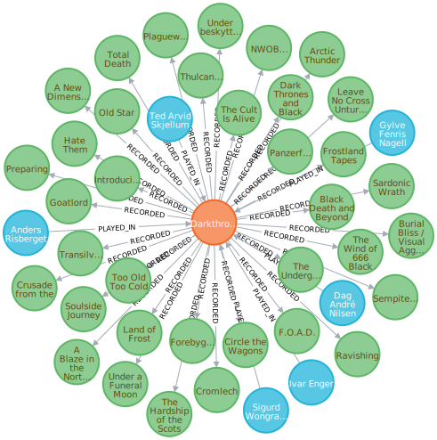
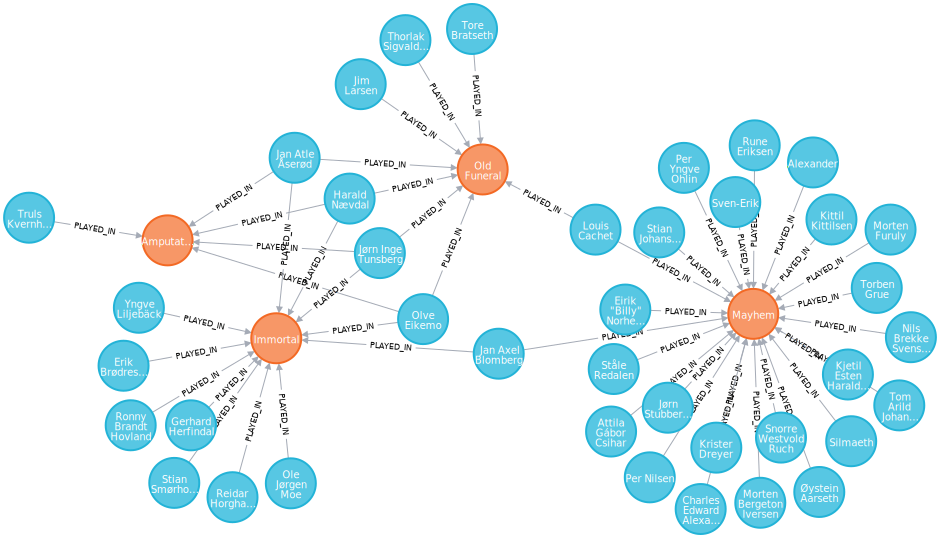
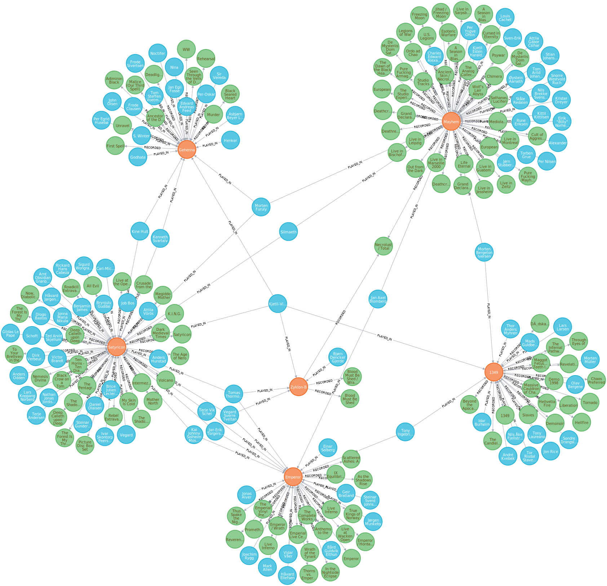
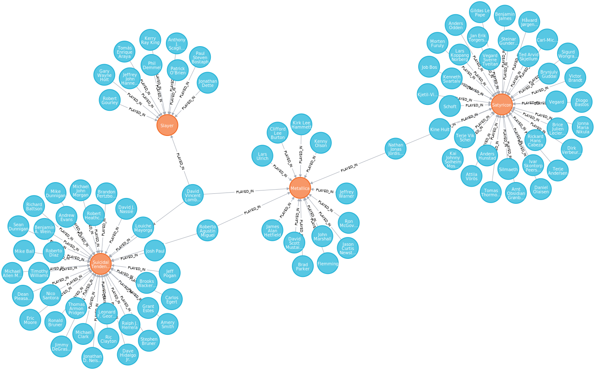

# Examples

## Darkthrone

A Neo4j export of [Darkthrone](https://www.metal-archives.com/bands/Darkthrone/146) looks like this (the band
in orange, releases in green and members in blue nodes):

## Neo4j export 2: Immortal, Amputation, Old Funeral, Mayhem

Visual representation of the connection of [Immortal](https://www.metal-archives.com/bands/Immortal/75), 
[Amputation](https://www.metal-archives.com/bands/Amputation/14401), 
[Old Funeral](https://www.metal-archives.com/bands/Old_Funeral/3969) and 
[Mayhem](https://www.metal-archives.com/bands/Mayhem/67) through their members.
 

### Query 

`MATCH (n:Band)--(m:Member) WHERE n.emid IN [67, 75, 3969, 14401] RETURN n, m`

### Short links

    Immortal/75
    Amputation/14401
    Old_Funeral/3969
    Mayhem/67

## More Norwegian black metal

Connection between some Norwegian black metal bands through their band members. Note the split 
[Necrolust / Total Warfare](https://www.metal-archives.com/albums/Mayhem/Necrolust_-_Total_Warfare/34805)
recorded by Mayhem and Zyklon-B. Just put these short links into a file and try it yourself:

    Emperor/30
    Zyklon-B/1421
    Mayhem/67
    Satyricon/341
    1349/5575
    Gehenna/2155

## India

The entire metal scene of [India](img/india.svg) in one picture. Following is the analysis of Indian
bands. 

    This raw analysis contains data of 219 bands from 1 countries. That is the entire database.
      India
        Bands: 219
        Population: 1366417754
        Bands per 100k people: 0.02
        Artists: 1165
          Male: 1155 (99.14%).
          Female: 8 (0.69%).
          Unknown/other: 2 (0.17%).

## Metallica and Satyricon

Live members are the glue which connect a lot of bands; even a Norwegian black metal band like
[Satyricon](https://www.metal-archives.com/bands/Satyricon/341) is related to the thrash institution
[Metallica](https://www.metal-archives.com/bands/Metallica/125). It's a bit far fetched but still
interesting enough to mention.

### Query 

`MATCH (n:Band)--(m:Member) WHERE n.emid IN [959, 72, 125 ,341] RETURN n, m`

### Short links

    Satyricon/341
    Metallica/125
    Suicidal_Tendencies/959
    Slayer/72
