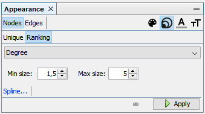

# How to use Gephi

_[Gephi](https://gephi.org/)_ is one of the tools to render graphs from the `.graphml` exported by _mmm_. This page 
gives a short introduction how to massage a graph into something useful.  

## Preparing a graph

For this example we take India with its manageable 230 bands (Dec 2019). Call mmm with the following parameters:

1. `-c IN`
2. `-b -f links/IN.lnks`
3. `-z IN`

Open the resulting `.graphml` in Gephi and make the following changes. They are going to change the node size based on
their degree (amount of connections to other nodes). Bands with no connection will be small, the ones with most 
connections will be larger.

The random layout is not very pretty. Let's apply the _ForceAtlas 2_ with these settings and hit the _Run_ button.

This leaves us with a graph that might look like the next picture. There's a larger network of connected bands and a lot
of either unconnected or less connected bands.

## Filter unconnected bands

1. Open _Topology_ from _Filters_. Drag a _Giant Component_ into _Queries_ located under the Filters.
2. Hit the play button.

This leaves you with a smaller network of 96 connected bands. Bands which are not connected to the main graph won't
be shown.

