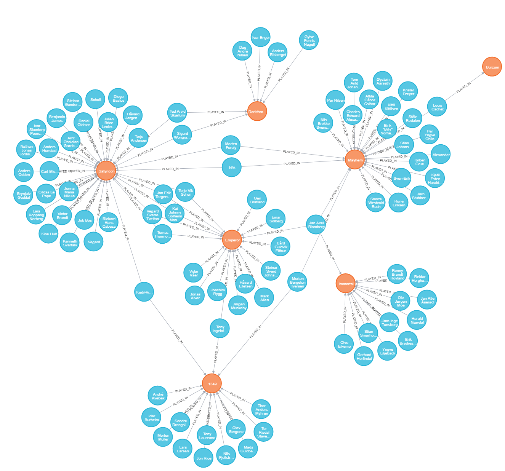

# Metal Mapper
_Metal Mapper_ is Python3 program and intended to be the basis to develop a toolset to access data of 
[Encyclopaedia Metallum: The Metal Archives](https://www.metal-archives.com/) (MA) and query said data. The
_Others_ section of [Add-ons](https://www.metal-archives.com/content/tools) links to two projects showcasing
interesting ways to visualize the _Metal Archives'_ data:

* [Metal Map](https://metal-map.com/): A visualization of bands by country displayed on a map, with data from M-A.
* [Metal Graph](http://metal-graph.com/): A graph showing the connections between Norwegian black metal bands, 
    with data from M-A. 

## Highlights

* Generates lists for bands to crawl based on countries, regions or the entire database.
    It also accepts handcrafted files with bands of your choice.
* Extracts information on bands, their band members and releases from MA.
* Saves ~~everything~~ a lot of the retrieved data into a Neo4j database for further analysis.
    The desktop version of Neo4j brings a graphical browsers to examine smaller networks around
    1000 nodes.
* Extracts band networks in [GraphML](http://graphml.graphdrawing.org/) for use in other tools. 

## Installation

### Python3

A Python3 installation >= 3.6 is needed to execute Metal Mapper.

### Neo4j

Data is stored in a [Neo4j database](https://neo4j.com/product/).
Download and install the [desktop version](https://neo4j.com/download/). 

### Library Hack

While crawling band links I encountered a defect in `Lib/http/client.py`. 
The percent escaped characters were not resolved correctly. The solution for
me was to change `putrequest()` (before `self._output()` is called). The line
looks like this:

    url = rfc3986.uri_reference(url).unsplit()
    
Needs to import `rfc3986` to function.

### Metal Mapper

Clone this repo and execute `python metalMapper.py` (see _How to use_ section). 

## Basics

### Countries

Countries on MA and this tool are represented in [ISO 3166](https://en.wikipedia.org/wiki/ISO_3166-1_alpha-2)
two letter format. Whenever you read _NN_ in context with countries, a two letter country code is meant.

A list of all countries with at least one band is shown on calling with the switch `-l`.

### Regions

A _region_ is a group of countries defined inside `country_helper.py` file. Available regions 
are shown on calling with the switch `-l`.

A popular region is are the nordic countries *NC* (containing Denmark, Sweden, Norway, Iceland, Finland, 
Greenland, Faroe Islands, Åland Islands, Svalbard and Jan Mayen).

### Graph Databases

A [graph database](https://en.wikipedia.org/wiki/Graph_database) is ideal to store data from MA for
further analysis. Bands and their members are nodes. They are connected through edges storing e.g. data
like what pseudonym a member used in a certain band or what instruments were played.   

## How to use

`metalMaper.py`, when called without switches, shows a list of compiler switches and some hints
how to use them.

### Use Case: Crawl Norway

1. Get all Norwegian bands: `metalMapper.py -c NO`
2. Crawl all bands in Norway: `metalMapper.py -b -f links/bands-NO.lnks`
3. Open Neo4j Desktop and look at the graph.
4. Print raw analysis in the terminal and export a `.graphml` file: `metalMapper.py -z NO`

### Bootstrapping: Crawl _all_ available countries

Calling with the switch `-a` will:

1. Generate a list of all countries (from MA's [by country page](https://www.metal-archives.com/browse/country))
with at least one band entry.
2. Extract the link for every band in every country and save the links in a folder with the same name.
    The name of the files follows this simple scheme: `bands-NN.lnks` where NN is the two letter short form.
    The contents of an `.lnks` file looks like this:
    ```
    Akollonizer/3540362756
    Among_the_Mist/7576
    Nami/3540321763
    Persefone/12779
    ```
    Together with `https://www.metal-archives.com/bands/` a fully fledged link to every band can be generated.
    
### Boostrapping at smaller scale: Crawl a country or a region

If you're not interested in getting the band links for all countries you can either 

* start with the switch `-c NN` to crawl all bands in exactly one country **or** 
* call with `-r NN` where NN is the key of the region you want to crawl.

### Neo4j database

#### Settings file

Use `settings.py` to set the following properties:

    NEO4J_USERNAME = "neo4j"
    NEO4J_PASSWORD = "CHANGEME"
    NEO4J_IP_ADDRESS = "localhost"

#### Nodes

##### Band

A _band_ is a node connected to members through a `played_in` relationship and has the 
following properties:

* `emid`: The band id used on MA.
* `name`: Name of the band.
* `country`: The country of origin as a two letter ISO code. Uses `COUNTRIES`.
* `locations`: Locations where the bands was active in.
* `status`: Short form of the `BAND_STATUS`. One of six possible values.
* `formed`: MA only uses years in for dates on the band page. To get it somehow right,
    we use Jan 1st and Dec 31st for as start and end dates.
* `themes`: Themes used in the lyrics.
* `genres`: Genres the band played. This could be a relationship or a collection.
    Need to learn a bit more about the string and how to cut it up.
* `current_lineup`: Relationship (PLAYED_IN) from a Member.

##### Member

A _member_ is a node connected to bands through a `played_in` relationship and has the 
following properties:

* `emid`:  The artist id used on MA.
* `name`: Name of the band member. Note that pseudonyms or instruments are part of the 
    `MemberRelationship`.
* `age`: Age of the member at the time of crawling. It might contain -1 as a value if the age is
    unknown.
* `gender`: Gender from `GENDER` dictionary.
* `played_in`: Relationship to a band.

#### Relationships

##### PLAYED_IN

Is directed from a Member to a Band and uses the model `MemberRelationship`. 

#### Abbreviations/Lookup Dictionaries

The Keys are used inside the database and line up with the value which is used in MA.

##### GENDER

    'M': 'Male',
    'F': 'Female',
    'U': 'Unknown/other'
    
##### COUNTRIES

    ...
    'NF': 'Norfolk Island',
    'MP': 'Northern Mariana Islands',
    'NO': 'Norway',
    ...
    
##### BAND_STATUS

    'A': 'Active',
    'H': 'On hold',
    'C': 'Changed name',
    'S': 'Split-up',
    'U': 'Unknown',
    'D': 'Disputed'

#### Screenshots

Connection between some Norwegian black metal bands through their band members. A lot of band members
are not connected to anything else because only the shown bands were visited.



One of the next milestones will be adding details like releases and which labels they were releases on.
The screenshot shows a few nodes from prototyping.


## Known Issues

* The instruments of artists are a string separated by commas. This might be
    inconvenient for any analysis on the individual instruments.
* The hierarchy of the instrument structure for artists may be in the wrong order.
* Crawling the whole database of almost 130.000 bands will take a very long time (one or two days). 
    You will probably run out of memory before that. There is no flushing of intermittent results. Which 
    brings us to the...

## Backlog

* Memorize which bands wre already visited (e.g. for long runs or when it crashes). 