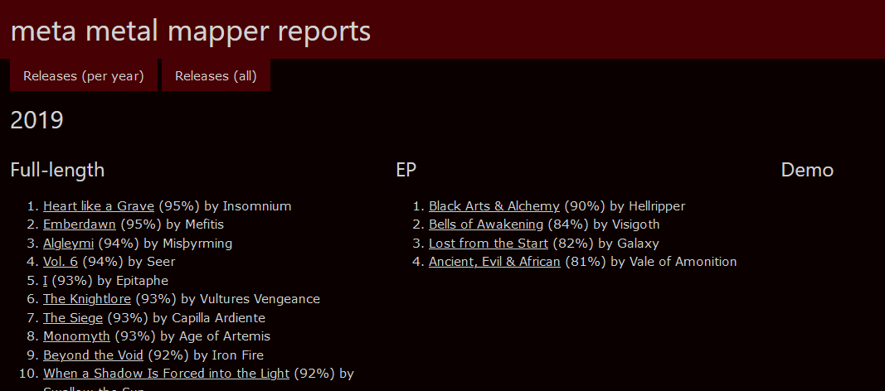

# Metal Mapper
_Metal Mapper_ is a Python3 program intended to be the basis for a toolset to access data of 
[Encyclopaedia Metallum: The Metal Archives](https://www.metal-archives.com/) (M-A) and query said data. The
_Others_ section of [Add-ons](https://www.metal-archives.com/content/tools) links to two projects showcasing
interesting ways to visualize the _Metal Archives'_ data:

* [Metal Map](https://metal-map.com/): A visualization of bands by country displayed on a map, with data from M-A.
* [Metal Graph](http://metal-graph.com/): A graph showing the connections between Norwegian black metal bands, 
    with data from M-A. 
    
Neither project mentions _how_ they get the presented data. _Metal Mapper_ aims at closing the gap for your own
projects.  

## Highlights

* Generates lists for bands to crawl based on countries, regions or the entire database.
    It also accepts handcrafted files with bands of your choice.
* Extracts information on bands, their band members and releases from M-A.
* Saves ~~everything~~ a lot of the retrieved data into a Neo4j database for further analysis.
    The desktop version of Neo4j brings a graphical browser to examine smaller networks around
    1000 nodes.
* Extracts band networks in [GraphML](http://graphml.graphdrawing.org/) for use in other tools.
* Head over to the [examples](EXAMPLES.md) to see some networks.
* Exports CSV files with country reports or database reports of all countries and their genres.

## Getting Started

### Python3

A Python3 installation >= 3.6 is needed to execute Metal Mapper.

If you see output like this

      File "metal_mapper.py", line 36
        f'Supported modes:\n'
                            ^
    SyntaxError: invalid syntax

you need to run the program explicitly with `python3 metal_mapper.py`.

### Libraries

metalMapper depends on the following packages:
* [certifi](https://certifi.io/en/latest/)
* [urllib3](https://urllib3.readthedocs.io/en/latest/)
* [beautifulsoup4](https://www.crummy.com/software/BeautifulSoup/bs4/doc/)
* [neomodel](https://neomodel.readthedocs.io/en/latest/)
* [progressbar2](https://pypi.org/project/progressbar2/)

Install them with `pip3`:

    pip3 install -r requirements.txt

### Neo4j

All data is stored in a [Neo4j database](https://neo4j.com/product/). You have to download and install the
[desktop version (Windows)](https://neo4j.com/download/) to use any meaningful functionality. The downside for some 
users might be the mandatory use of a Google or Facebook account to authorize the desktop app. However a 30 day trial
period for the software is granted. If you know what you're doing you may simply set up Neo4j from other available 
editions. There is e.g. the official 
[Linux guide](https://neo4j.com/docs/operations-manual/current/installation/linux/debian/).

Fire it up and create a database. Change the database credentials as needed in `settings.py`.

#### Starting Neo4j Appimage on Linux

If the Neo4j Appimage does not start the desktop window, check the console log for:

    The name org.freedesktop.secrets was not provided by any .service files
    
Installation of the gnome-keyring helped me in that case:

    sudo apt install gnome-keyring

### Library Hack

While crawling band links on Windows I encountered a defect in `Lib/http/client.py`. The percent escaped characters were
not resolved correctly. The solution for me was to change `putrequest()` (before `self._output()` is called). The line
looks like this:

    url = rfc3986.uri_reference(url).unsplit()
    
This hack needs to import `rfc3986` to function.

### Metal Mapper

Clone this repo and execute `python metal_mapper.py` (see _How to use_ section). 

## Basics

### Countries

Countries on M-A and this tool are represented in [ISO 3166](https://en.wikipedia.org/wiki/ISO_3166-1_alpha-2)
two letter format. Whenever you read _NN_ in context with countries, a two letter country code is meant. Two special
countries exist: XX (international) and YY (unknown).

A list of all countries with at least one band is shown on calling with the switch `-l`.

### Regions

A _region_ is a group of countries defined inside the file `country_helper.py`. Available regions are shown on calling 
`metal_mapper.py` with the switch `-l`.

Popular regions are *NCO*; nordic countries (containing Denmark, Sweden, Norway, Iceland, Finland, Greenland, Faroe
Islands, Åland Islands, Svalbard and Jan Mayen) and *SCA*; Scandinavia (as above but _without_  Åland Islands, Svalbard
and Jan Mayen).

### Graph Databases

A [graph database](https://en.wikipedia.org/wiki/Graph_database) is ideal to store data from M-A for further analysis.
Bands and their members are nodes. They are connected through edges storing e.g. data, like what pseudonym a member used
in a certain band or what instruments were played.   

## How to use

`metal_mapper.py`, when called on without switches, shows a list of program switches and some hints how to use them. The
program does not have an interactive mode. Every function needs data from previous runs, except the bootstrapping.

The typical workflow follows these steps: 

1. Crawl a country or a region for band links on M-A,
2. Create a graph in Neo4j Desktop,
3. Crawl bands,
4. Opening Neo4j Desktop and inspect the graph and
5. Print raw analysis in the terminal, export `.graphml` and statistics files.
    
The following sections will guide you through the usage of the program.

### Boostrapping: Crawl a country or a region for band links

The initial requirement to use mmm is having band links to crawl. There are two ways of creating band lists:

* Start with the switch `-c NN` to crawl all bands in exactly one country **or** 
* Call with `-r NNN` where NNN is the key of the region you want to crawl.

Crawling an entire region is recommended only for small regions with a low amount of bands or to update with new bands.

Band list files are generated by country (from M-A's ["by country page"](https://www.metal-archives.com/browse/country))
with at least one band entry.
The names of the files follow this simple scheme: `NN.lnks` where NN is the two letter short form.

The contents of an `.lnks` file looks like this:

    Akollonizer/3540362756
    Among_the_Mist/7576
    Nami/3540321763
    Persefone/12779

Together with `https://www.metal-archives.com/bands/` a fully fledged link to every band can be generated whenever it is
needed. You can easily build files with the short links of your favorite bands.

You can define your own regions in `country_helper.py`. Just make sure that a region code has three letters (or more)
so that no country link files will be overwritten in a crawl.

### Create a graph in Neo4j Desktop

Before bands can be crawled a database needs to be created.

1. Open Neo4j Desktop.
2. Click _Add Graph_ → _Create a Local Graph_.
3. Give it a name and a password.
4. Open `settings.py` and change `NEO4J_PASSWORD` to what you entered in the above step.
5. Start the database. Remember that you need to start the database every time you want to interact with the database.  

### Crawl bands

Several options are available to crawl bands from the above generated link files:
1.  `-b -f <path/to/file>`: Crawls the bands in the given file.
2. `-b -F <countries>`: In this case `<countries>` is a comma separated list of ISO shorts (`N1,N2,N3`). Don't use white
    spaces unless you enclose the entire list in double quotes (`"N1, N2, N3"`).
3. `-b`: Crawls _every_ band from all files found in `./links`. This mode is not recommended. It will take
    a long time to finish.

Eight threads are used by default to crawl for bands (See the 
[performance analysis](DESIGN_NOTES.md) for the amount of crawling threads).
Data is applied immediately to the [graph database](DATABASES.md) and won't be overwritten.

#### Error cases

A band might encounter unrecoverable errors while crawling. This might happen if the band does not exist or the network
connection breaks down. Unrecoverable bands will be saved in a file in `./links` and a name like 
`_bands_with_errors_{time_stamp}`. The resulting files contain short band links (as the other `.lnks` files) and can be
used for crawling. If you notice from the log that a band was removed from M-A simply remove the line from the file. In
case of defects drop me a message or fix it yourself and issue a pull request.

### Inspecting a graph

Open Neo4j Desktop and inspect the graph.

  1. Install Neo4j Browser with the "Add Application" button inside Neo4j Desktop.
  1. Start Neo4j Browser.
  3. Click on the database icon (top left).
  4. Enter `MATCH (n) RETURN n LIMIT 250` in the text box starting with the $ symbol and press play. 
  
You might want to use a higher number than 250 if you already have more than 250 entities in the database. Depending on
how strong your machine is, ~1000 might be the usable maximum. To change the maximum node number you need to open the Neo4j
Browser, click on the cog icon (lower left) anf change the value of _Initial Node Display_. 

See also [database entities](DATABASES.md) for in-depth details and the [examples](EXAMPLES.md) section.

### Analysis

After e.g. crawling a region or a country, you can start analyzing the data. Running the program with either of the
available switches prints some information on the command line. Far more interesting are the exported CSV and GraphML
files. They are named after their general category followed by a timestamp and the file type (depicted by a * in the
following sections).

* `-y`: Considers the entire database.
* `-z <countries>`: In this case `<countries>` is a comma separated list of ISO shorts (`N1,N2,N3`). Don't use white
    spaces unless you enclose the entire list in double quotes (`"N1, N2, N3"`).

#### Countries

List countries and their properties like total number of bands, bands per 100k people, a gender breakdown and the TOP
genre.

The file pattern is `countries_*`.

| Country | Population | Bands | Bands per 100k | # Total | # Male | % Male | # Female | % Female | # Unknown | % Unknown | TOP genre |
| ------------- |---------------|------|------|------|------|------|------|------|------|------|------|
| Norway | 5378857 | 1702 | 31,64 | 5782 | 5523 | 95,52 | 240 | 4,15 | 19 | 0,33 | Black Metal |
| Denmark | 5771876 | 999 | 17,31 | 3623 | 3545 | 97,85 | 77 | 2,13 | 1 | 0,03 | Death Metal |

#### All genres
 
List all known genres and the count for each one per country.

The file pattern is `genres_all_*`.

| Genre | Total | Norway | Denmark |
|---|---|---|---|
| Black | 1135 | 862 | 271 |
| Death | 732 | 381 | 351 |
| Thrash | 441 | 249 | 192 |
| Heavy | 316 | 147 | 169 |
| Doom/Stoner/Sludge | 298 | 178 | 120 |

#### All core genres

_Core_ does not mean what you might think in this context. It's merely the most 
[common genre names](https://www.metal-archives.com/browse/genre) as M-A defines them.

The CSV contains the core genres and the count for each one per country.   
    
The file pattern is `genres_core_*`.

It looks similar to the _all genres_ table.

#### Releases per year

This CSV groups releases on a per year basis. Most recent year at the top. The releases per year are grouped descending
on their rating. Release entries in the database store the average rating of e.g. a full length album or demo. The other
metric is the number of reviews. I arbitrarily tried cut-off values to filter releases:

* `RELEASE_REVIEW_COUNT_MIN`: The minimum amount of reviews a release needs to be considered for the export (default 3).
* `RELEASE_AVERAGE_MIN`: The minimum average score a release needs (default 80).
* `RELEASE_TYPES_REVIEW`: By default we consider Albums (F), EPs (E) and Demos (D). Other valid types can
    be found in `RELEASE_TYPES`(see `choices.py`).
   
If you don't like the standard settings from `settings.py`, try to change the properties to something that works for 
you. The file pattern is `releases_per_year_*`. Note that a JSON file of the release data is also exported.

#### Bands formed per year

Files named `bands_formed_*` give an overview of how many bands were formed over the years. The time frame is decided by
the oldest and newest bands. Years with no bands within the time span will be added with zero as count. Columns are 
sorted left to right by total amount of bands formed.

#### HTML reports

An HTML file with all and per year releases is generated inside the reports folder. The reports can be influences with
 `settings.py` as described above. 

#### Usage and output example

Two switches are available to analyze data, print to the command line, and export `.graphml` networks:

* `-y`: Analyze the entire database.
* `-z NN`: Analyze only the given country.
* `-z NN1,NN2,RR1`: Analyze all given countries and/or regions.  

The country analysis for all Norwegian band might look similar to this:

    Norway
      Population: 5,378,857
      Bands: 1706
      Bands per 100k people: 31.72%
      Gender distribution (5779 artists from 45 countries)
        Male: 5520 (95.52%)
        Female: 240 (4.15%)
        Unknown/other: 19 (0.33%)
      TOP 5 Genres;
        Black: 865 (50.70%)
        Death: 381 (22.33%)
        Thrash: 249 (14.60%)
        Doom/Stoner/Sludge: 178 (10.43%)
        Progressive: 165 (9.67%)

By default all bands (including unconnected ones) are exported. Band members which played only live are considered to be
part of a band. These options are available in `settings.py`:

* `IS_LIVE_MEMBER_IN_BAND`: Used to decide if a live band member is considered to make connections between bands or not.
* `FILTER_UNCONNECTED`: Any band which is not connected to any other bands will be filtered.

#### Using exported `.graphml` files

The [Gephi intro page](GEPHI_HOWTO.md) explains how to use the generated `.graphml` files. 

## Known Issues

* `PLAYED_IN` relationships are be overwritten with the last one found. An artist, which was a regular
    band member and helped out live in the past will be considered to be "only" `PL` [past (live)]. 
* The hierarchy of the instrument structure for artists may be in the wrong order.

## Backlog

* Notify user on calling analysis if a country has not been mapped entirely. 
* Implement a flag to overwrite data unconditionally.
* Implement option to overwrite data based on its age.
* Connecting releases with labels. The screenshot shows additional label nodes (and their connections) from prototyping.
    
