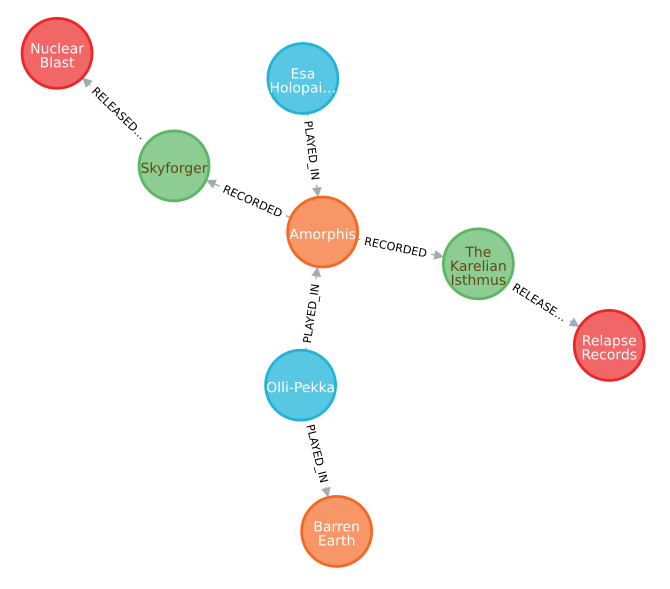

# Metal Mapper
_Metal Mapper_ is Python3 program and intended to be the basis to develop a toolset to access data of 
[Encyclopaedia Metallum: The Metal Archives](https://www.metal-archives.com/) (MA) and query said data. The
_Others_ section of [Add-ons](https://www.metal-archives.com/content/tools) links to two projects showcasing
interesting ways to visualize the _Metal Archives'_ data:

* [Metal Map](https://metal-map.com/): A visualization of bands by country displayed on a map, with data from M-A.
* [Metal Graph](http://metal-graph.com/): A graph showing the connections between Norwegian black metal bands, 
    with data from M-A. 

## Highlights

* Generates lists for bands to crawl based on countries, regions or the entire database.
    It also accepts handcrafted files with bands of your choice.
* Extracts information on bands, their band members and releases from MA.
* Saves ~~everything~~ a lot of the retrieved data into a Neo4j database for further analysis.
    The desktop version of Neo4j brings a graphical browsers to examine smaller networks around
    1000 nodes.
* Extracts band networks in [GraphML](http://graphml.graphdrawing.org/) for use in other tools.
* Head over to [examples](EXAMPLES.md) to see some networks.
* Exports CSV files with country reports or database reports of all countries and their genres. 

## Getting Started

### Python3

A Python3 installation >= 3.6 is needed to execute Metal Mapper.

If you see output like this

      File "metalMapper.py", line 36
        f'Supported modes:\n'
                            ^
    SyntaxError: invalid syntax

you need to run the program explicitly with `python3 metalMapper.py`.

### Libraries

metalMapper depends on the following packages:
* [bs4](https://pypi.org/project/beautifulsoup4/) (BeautifulSoup)
* [neomodel](https://neomodel.readthedocs.io/en/latest/)
* [progressbar](https://pypi.org/project/progressbar/)

Install them with `pip3`:

    pip3 install bs4 neomodel progressbar2

### Neo4j

Data is stored in a [Neo4j database](https://neo4j.com/product/).
If you want to explore graphs locally you should download and install the 
[desktop version (Windows)](https://neo4j.com/download/).
The downside for some users might be the mandatory use of a Google of Facebook account to authorize
the desktop app. 30 days to try the software without authorizations is given.
If you know what you're doing you may simply set up Neo4j from other
available editions. There is e.g. the official Linux 
[guide](https://neo4j.com/docs/operations-manual/current/installation/linux/debian/).

Fire it up and create a database.
Change the database credentials as needed in `settings.py`.

#### Starting Neo4j Appimage on Linux

If the Neo4j Appimage does not start the desktop window check the console logs contents like:

    The name org.freedesktop.secrets was not provided by any .service files
    
Installation of the gnome-keyring helped me in that case.

    sudo apt install gnome-keyring

### Library Hack

While crawling band links on Windows I encountered a defect in `Lib/http/client.py`. 
The percent escaped characters were not resolved correctly. The solution for
me was to change `putrequest()` (before `self._output()` is called). The line
looks like this:

    url = rfc3986.uri_reference(url).unsplit()
    
This hack needs to import `rfc3986` to function.

### Metal Mapper

Clone this repo and execute `python metalMapper.py` (see _How to use_ section). 

## Basics

### Countries

Countries on MA and this tool are represented in [ISO 3166](https://en.wikipedia.org/wiki/ISO_3166-1_alpha-2)
two letter format. Whenever you read _NN_ in context with countries, a two letter country 
code is meant. Two special countries exist: XX (international) and YY (unknown).


A list of all countries with at least one band is shown on calling with the switch `-l`.

### Regions

A _region_ is a group of countries defined inside `country_helper.py` file. Available regions 
are shown on calling with the switch `-l`.

A popular region is the nordic countries *NC* (containing Denmark, Sweden, Norway, Iceland, Finland, 
Greenland, Faroe Islands, Åland Islands, Svalbard and Jan Mayen).

### Graph Databases

A [graph database](https://en.wikipedia.org/wiki/Graph_database) is ideal to store data from MA for
further analysis. Bands and their members are nodes. They are connected through edges storing e.g. data
like what pseudonym a member used in a certain band or what instruments were played.   

## How to use

`metalMaper.py`, when called without switches, shows a list of compiler switches and some hints
how to use them. The program does not have an interactive mode. Every function (but the
bootstrapping) needs data from previous runs.

### Use Case: Crawl and Analyse Norway

1. Get all known Norwegian band links from MA: `metalMapper.py -c NO`
2. Crawl all Norwegian bands: `metalMapper.py -b -f links/NO.lnks`
3. Open Neo4j Desktop and look at the graph.
4. Print raw analysis in the terminal and export a `.graphml` file: `metalMapper.py -z NO`

### Bootstrapping: Crawl _all_ available countries

Calling with the switch `-a` will:

1. Generate a list of all countries (from MA's [by country page](https://www.metal-archives.com/browse/country))
with at least one band entry.
2. Extract the link for every band in every country and save the links in a folder with the same name.
    The name of the files follows this simple scheme: `NN.lnks` where NN is the two letter short form.
    The contents of an `.lnks` file looks like this:
    ```
    Akollonizer/3540362756
    Among_the_Mist/7576
    Nami/3540321763
    Persefone/12779
    ```
    Together with `https://www.metal-archives.com/bands/` a fully fledged link to every band can be generated
    whenever it is needed.
    
### Boostrapping at smaller scale: Crawl a country or a region

If you're not interested in getting the band links for all countries you can either 

* start with the switch `-c NN` to crawl all bands in exactly one country **or** 
* call with `-r NN` where NN is the key of the region you want to crawl.

### Crawl bands

Two options are available to crawl bands from the above generated link files:
1. `-b`: Crawls _every_ band from all files found in `./links`. This mode is not recommended. It will take
    a long time finish. Better use
2.  `-b -f filename`: Crawls the bands in the given file.

Data is applied immediately to the database and won't be overwritten.


All data is stored in a [database](DATABASES.md).

#### Error cases

A band might encounter unrecoverable errors while crawling. It might happen if the band does not exist
or the network connection breaks down. Unrecoverable bands will be saved in a file in `./links` and a 
name like `_bands_with_errors_{time_stamp}`. The resulting files contain short band links (as the other 
`.lnks` files) and can be used for crawling. If you notice from the log that a band was removed from MA
simply remove the line from the file. In case of defects drop me a message or fix it yourself and issue
a pull request.

### Analysis

Two switches are available to analyze data and export `.graphml` networks:

* `-y`: Analyze the entire database.
* `-z NN`: Analyze only the given country.
* `-z NN1,NN2,RR1`: Analyze all given countries and/or regions.  

The country analysis for all Norwegian band might look similar to this:

    Norway
      Population: 5,378,857
      Bands: 1706
      Bands per 100k people: 31.72%
      Gender distribution (5779 artists from 45 countries)
        Male: 5520 (95.52%)
        Female: 240 (4.15%)
        Unknown/other: 19 (0.33%)
      TOP 5 Genres;
        Black: 865 (50.70%)
        Death: 381 (22.33%)
        Thrash: 249 (14.60%)
        Doom/Stoner/Sludge: 178 (10.43%)
        Progressive: 165 (9.67%)

## Known Issues

* `PLAYED_IN` relationships are be overwritten with the last found one. Means an artists which was a regular
    band member and helped out live in the past will be considered to be "only" to be a `PL` (past (live)). 
* The hierarchy of the instrument structure for artists may be in the wrong order.

## Backlog

* Allow fine tuning the band relationships (e.g. don't connect bands through artists who were only part
    of the live line-up).
* Implement a flag to overwrite data unconditionally.
* Implement option to overwrite data based on how old it is.
* Connecting releases with labels. The screenshot shows a few nodes from prototyping.

