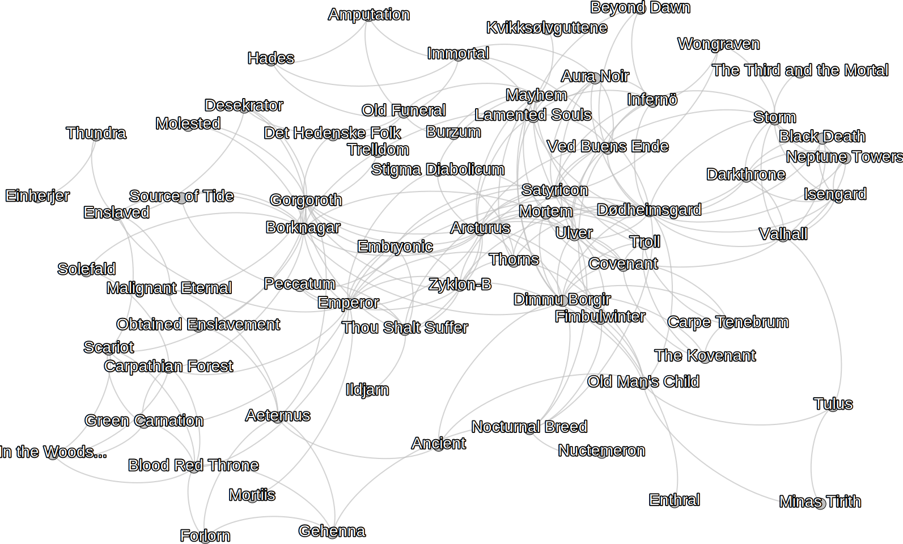

# Meta Metal Mapper

_Meta Metal Mapper_ is a Python3 program to crawl
[Encyclopaedia Metallum: The Metal Archives](https://www.metal-archives.com/)
(M-A) for bands, artists and releases. The data is stored in a in a local 
database and can be analyzed and exported into band networks.

The first time I saw a band network was in the liner notes of the 7" EP
compilation
[True Kings of Norway](https://www.metal-archives.com/albums/Immortal/True_Kings_of_Norway/111142)
almost 20 years ago. Networks and info graphics fascinated me ever since. My
interest in band networks and statistics was renewed when I found two projects
in the _Others_ section of [Add-ons](https://www.metal-archives.com/content/tools)
on M-A:

* [Metal Map](https://metal-map.com/): A visualization of bands statistics by
  country displayed on a map, with data from M-A.
* [Metal Graph](http://metal-graph.com/): A graph showing the connections
  between Norwegian black metal bands, again with data from M-A.

Neither project release the means of _how_ they acquire the presented data. The
Metal Graph is limited to Norwegian black metal and the Metal Map lacks e.g.
album or gender statistics. Meta Metal Mapper closes these gaps and add even
more analyzed data. It's not flashy but it's the base for your own data science
projects.

## Highlight Reel

This is what Meta Metal Mapper already delivers:

* Crawls your favorite bands to generate small networks. 
* Generates lists for bands to crawl based on countries, regions or the entire
  database.  It also accepts handcrafted files with bands of your choice.
* Extracts information about bands, their band members and releases from M-A.
* Saves ~~everything~~ a lot of the retrieved data into a Neo4j database for
  further analysis.  The desktop version of Neo4j brings a graphical browser to
  examine small networks around 1000 nodes
  ([examples](documentation/EXAMPLES.md)).
* Extracts band networks in [GraphML](http://graphml.graphdrawing.org/) for use
  in other tools.
* Exports CSV files with country or database reports of all countries and their
  genres.
* Exports HTML pages of the best albums, EPs and demos.

And to rule out any disappointments; a list of things it is not:

* It won't automatically generate websites like the above Metal Map for you.

## Getting Started

To use Meta Metal Mapper you first need to clone this repository, install
Python libraries and Neo4j.

### Tool Installation

This here is the short version, a [longer version](documentation/GETTING_STARTED.md)
is also available.

Install the following tools:

1. Python >= 3.6.0.
2. Libraries: `pip3 install -r requirements.txt`.
3. Neo4j for [Windows](https://neo4j.com/download/) or
   [Linux](https://neo4j.com/docs/operations-manual/current/installation/linux/debian/).

### Setup

1. Start Neo4j Desktop and [create a 3.5.x graph](documentation/USAGE.md).
2. Start the created graph.
3. In the Neo4j Desktop application use _Add Application_ to install the Neo4j
   Browser.
4. Open `settings.py` and change `NEO4J_PASSWORD`.

### First Crawl and Analysis

This rather short section uses example data, but gives an idea what it is
about. A detailed [usage page](documentation/USAGE.md) explains what the 
parameters mean and what to do with them.

Call `python meta_metal_mapper.py` each time with one of the following
parameters:

1. `-c data/true_kings.lnks`: Uses the supplied file with band names, crawls
  all of them and puts data in to the database.
2. `-y ALL`: Prints analysis into terminal and generates several files with 
  exported data.

Please note that the analysis is across the entire database and might result in
meaningless data e.g. when data is put into relation to a country.

### Inspect the graph

1. Open the Neo4j Browser you installed during setup.
2. Click on the gear (lower left) and change _Initial Node Display_ to a number
  \>= 2000.
3. Copy `MATCH (n) RETURN n` into the command text field (starting with a $) 
  and hit the play button.
4. The displayed graph contains all crawled band, artist and album nodes.
5. Click on some of the nodes or edges to see the individual properties.

To filter the albums try `MATCH (b:Band)--(m:Member) RETURN b, m` and hit the
play button. The resulting graph is a bit slimmer.

### Inspect the report

Browse to the folder named `reports` and open a report in a web browser to see
the best albums, EPs and demos.

### Where to go from here?

* Crawl the extended network from the _True Kings of Norway_ CD with:
  * `meta_metal_mapper -c data/true_kings_ext.lnks`
  * Install [Gephi](documentation/GEPHI_HOWTO.md), load a `.graphml` file (see
    exports folder) and experiment with the available data.
  * A graph of the extended _True Kings_ network could look like:
  
* See the detailed [usage page](documentation/USAGE.md), the
  [glossary](documentation/GLOSSARY.md) or the
  [examples](documentation/EXAMPLES.md) for inspiration.

## Version History

### 0.97.7 (2022-01-03)

* Fixed two parsing errors which prevented adding ~12 bands and their band members.
  The "404" check should work as-is. Please raise a defect report if you encounter
  problems related to "not found" errors.

### 0.97.6 (2021-12-19)

* Added Malawi to the list of African countries and checked all other for new bands.
* Fixed a defect in a country definition where Austria was used instead of Ukraine.

### 0.97.5 (2020-11-09)
* Integrated handling of more gender options.
* Fixed defects where new libraries needed different error handling.
* Made crawling (option `-c`) consistent with the other options; it now accepts
  a list of country or region shorts or file names instead of a single argument.
* Refactored handling of internal data to dataclasses.

### 0.97.4 (2020-10-27)
* Added ASCII art logos at startup.
* Refactored the console logging (colors for bad things and less detailed).
* Fixed a log message to report the accurate number of bands added in a 
  single run.

### 0.97.3 (2020-08-11)
* Rewrote parameter usage. It's now much more reliable and a bit easier
to use.

### 0.97.2 (2020-06-28)
* Added a function to make the location data more usable. The earlier used
  mechanism just split the location string at every "/". This results in
  unusable data for e.g.
 
  `Kolbotn, Viken (early); Oslo (mid); Vinterbro, Viken / Trysil, Innlandet (later)`

  The new function returns the first city and state/territory it can determine
  (and ignores the rest for now).

### 0.97.0 (2020-06-06)
* Added two new modes:
* `-s <short link>` (e.g. Darkthrone/146): Crawls a single band and all
  connected bands (identified by the bands links the individual members
  played in).
* `-x`: Analyzes small networks (e.g. from one or several runs like above),
  essentially leaving out the country related details which depend e.g. on
  total band counts.
* Added console notification and export of link files for invalid bands 
  (which are in the database but not on M-A anymore) and missing bands (not
  in the database) but on M-A.
* Fixed a defect which prevented processing of unrated releases.

### 0.87.1 (2020-05-01): Bugfix release
* Added message in case an unsupported Neo4j 4.x database is used.

### 0.87.0 (2020-04-19):
* First public release.

## Acknowledgments

Thanks to Annukka, Suma, Henning and Marcel for their invaluable feedback.

## Known Issues

A couple of problems have already been [identified](documentation/ISSUES.md).
Please let me know if you find any other bugs or if you have questions. Use the
issue tracker in the repository or write to fnordoglargh at gmail dot com.

## Backlog

* Feature for analysis for band origins (based on location).
* Implement a flag to overwrite data unconditionally.
* Implement option to overwrite data based on its age.
* Connecting releases with labels. The screenshot shows additional label nodes
  (and their connections) from prototyping.
  

