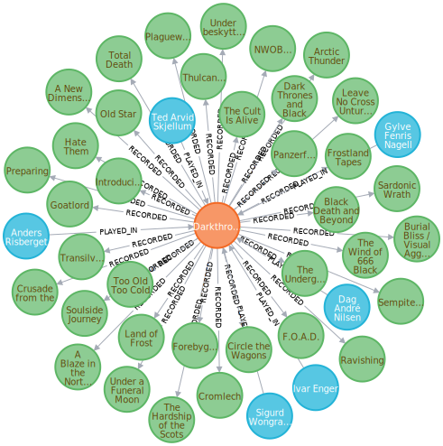
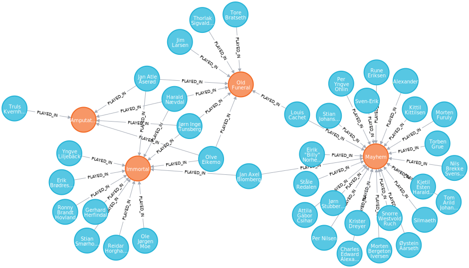
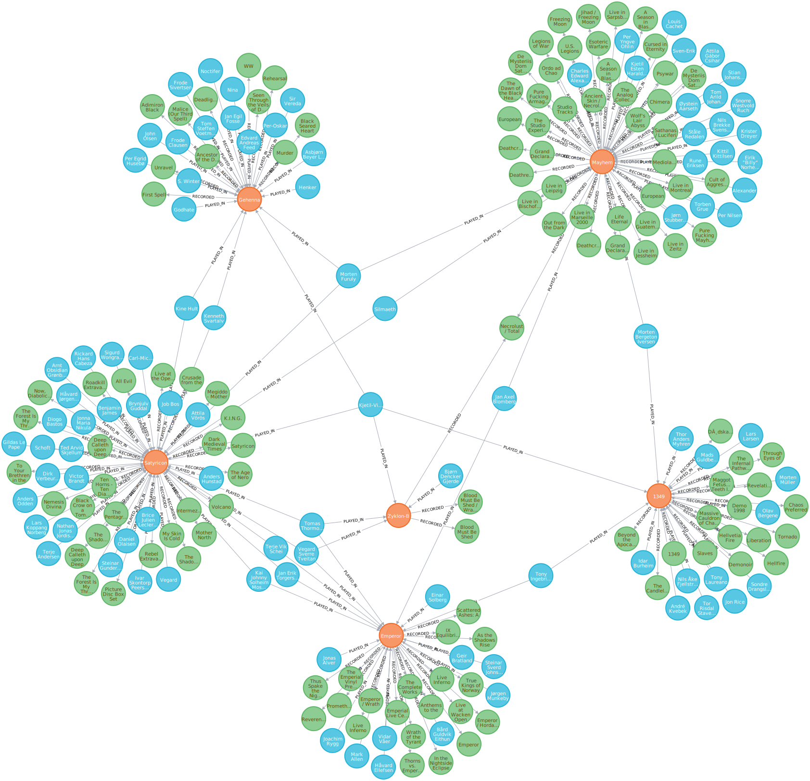
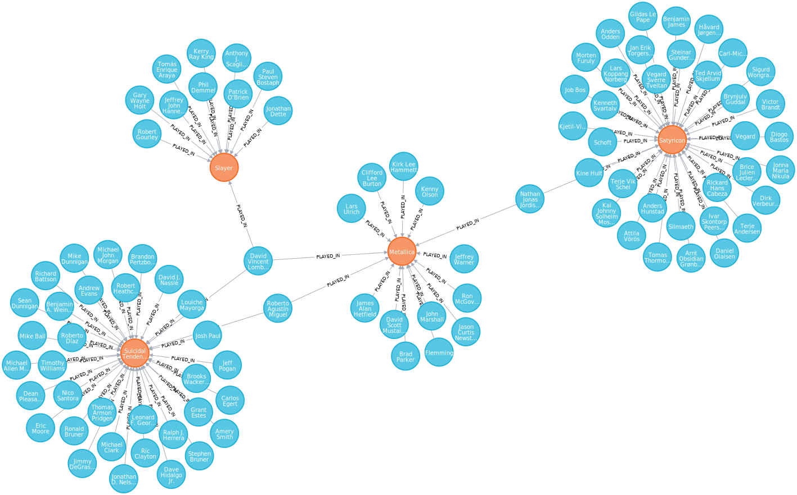

# Examples

For these examples you need to create some text files with the contents of the
_Short Links_ sections. You can put them anywhere you like, but the `links`
folder works best. Remember to call `meta_metal_mapper` with `-c path/to/file`.
It's safe to add all links to one file. Known entities (e.g. bands) will be 
skipped.

The queries are executed in the Neo4j Browser.

## A band and all nodes connected to it: Darkthrone

A Neo4j export of [Darkthrone](https://www.metal-archives.com/bands/Darkthrone/146)
looks like this (the band in orange, releases in green and members in blue
nodes):

### Query

    MATCH (b:Band{emid: 146})--(a) RETURN a,b

You may exchange Darkthrone's `emid` 146 for any other in the database to get
the same result; all connected nodes to the given band.

### Short Link

    Darkthrone/146

## Neo4j export 2: Immortal, Amputation, Old Funeral, Mayhem

Visual representation of the connection of [Immortal](https://www.metal-archives.com/bands/Immortal/75),
[Amputation](https://www.metal-archives.com/bands/Amputation/14401),
[Old Funeral](https://www.metal-archives.com/bands/Old_Funeral/3969) and
[Mayhem](https://www.metal-archives.com/bands/Mayhem/67) through their members.

### Query

    MATCH (n:Band)--(m:Member) WHERE n.emid IN [67, 75, 3969, 14401] RETURN n, m

### Short links

    Immortal/75
    Amputation/14401
    Old_Funeral/3969
    Mayhem/67

## More Norwegian black metal

Connection between some Norwegian black metal bands through their band members.
Note the split
[Necrolust / Total Warfare](https://www.metal-archives.com/albums/Mayhem/Necrolust_-_Total_Warfare/34805)
recorded by Mayhem and Zyklon-B. Just put these short links into a file and try
it yourself:

    Emperor/30
    Zyklon-B/1421
    Mayhem/67
    Satyricon/341
    1349/5575
    Gehenna/2155

The query is a less specialized version of the last one:

    MATCH (n:Band)--(m) WHERE n.emid IN [30, 67, 1421, 341, 5575,2155] RETURN n, m

`m` is not a member anymore but all connected nodes.

## India

The entire metal scene of [India](../img/india.svg) in one picture. Following is
the analysis of Indian bands.

    This raw analysis contains data of 219 bands from 1 countries. That is the entire database.
      India
        Bands: 219
        Population: 1.366.417.754
        Bands per 100k people: 0.02
        Artists: 1165
          Male: 1155 (99.14%).
          Female: 8 (0.69%).
          Unknown/other: 2 (0.17%).

## Metallica and Satyricon

Live members are the glue which connect a lot of bands; even a Norwegian black
metal band like [Satyricon](https://www.metal-archives.com/bands/Satyricon/341)
is related to the thrash institution
[Metallica](https://www.metal-archives.com/bands/Metallica/125). It's a bit far
fetched but still interesting enough to mention.

### Query

`MATCH (n:Band)--(m:Member) WHERE n.emid IN [959, 72, 125 ,341] RETURN n, m`

### Short links

    Satyricon/341
    Metallica/125
    Suicidal_Tendencies/959
    Slayer/72

