# How to use Gephi

_[Gephi](https://gephi.org/)_ is one of the tools to render graphs from the `.graphml` exported by Meta Metal Mapper. 
This page gives a short introduction how to massage a graph into something useful.  

## Preparing a graph

For this example we use Lebanon with its manageable 51 bands (Dec 2019). Call `meta_metal_mapper` three times with the 
following parameters:

1. `-c LB`
2. `-b -F LB`
3. `-y`

Open the resulting `.graphml` in Gephi and make the following changes. They are going to change the node size based on
their degree (amount of connections to other nodes). Bands with no connection will be small, the ones with most 
connections will be larger.

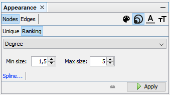

The random layout is not very pretty. Let's apply the _ForceAtlas 2_ with these settings and hit the _Run_ button.

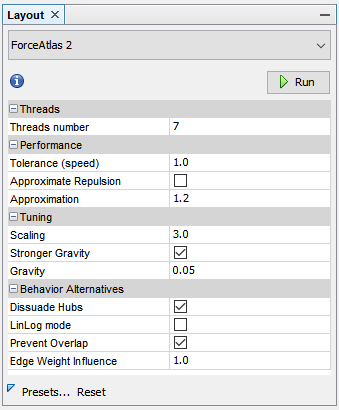

This leaves us with a graph that might look like the next picture. There's a network of connected bands and a lot of
either unconnected or less connected bands.

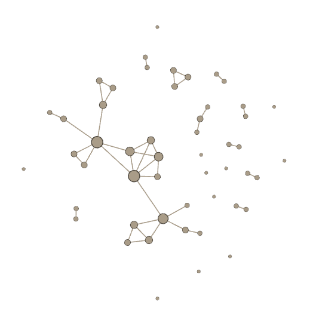

## Filter unconnected bands

1. Open _Topology_ from _Filters_. Drag a _Giant Component_ into _Queries_ located under the Filters.
2. Hit the play button.

This leaves you with a smaller network of 20 connected bands. Bands which are not connected to the main graph won't
be shown.

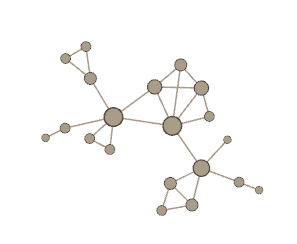

## Adding a few metal communities

The graph is a bit thin. Let's add bands from Syria (SY), United Arab Emirates (AE) and Kuwait (KW).

1. `-c SY,AE,KW`
2. `-b -F SY,AE,KW`
3. `-y`

Load the new file into Gephi. It looks a bit bland, but we can let Gephi apply some color.

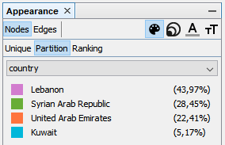

Now run the ForceAtlas 2 again.

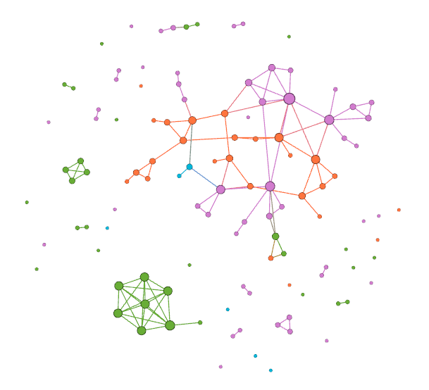

## Filter countries

If you end up with a large graph and you want to remove nodes you can either make a new export from the database or you
can filter by _country_ (found in _Attributes_ → _Eqaual_). Simply drag _country_ under your Giant Component.

To display only band nodes from AE and LB, enter "United Arab Emirates|Lebanon" into the text box and check the box _Use
regex_. Don't forget to push the play button.

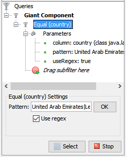

You can achieve the reverse by adding a _NOT_ from the _Operators_. Put it right before the _Equal (country)_. The 
following snip from the Gephi shows a graph of the middle eastern network _without_ Kuwait and unconnected bands. 

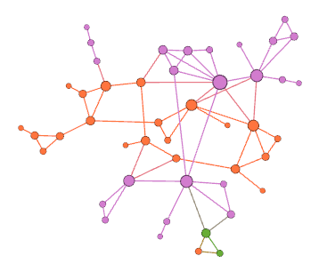

A more comprehensive guide can be explored in the 
[Gephi Tutorials](https://seinecle.github.io/gephi-tutorials/generated-html/using-filters-en.html).

## Exporting the graph

In the previous sections we only used the preview to look at the graphs. Gephi has built-in ways to export a graph e.g.
as a PNG or a PDF. When band names are shown, the PNG has to be quite large. Otherwise it will be very hard to read the
smaller labels.

Head over to _Preview_. Select any of the _Presets_ and experiment with something you like. The standard settings of
_Black Background_ work well. Some massaging of the graph is likely to be needed. Hit the _Refresh_ button once and have
a look if the labels are readable and don't overlap. Sometimes a graph might look cramped.

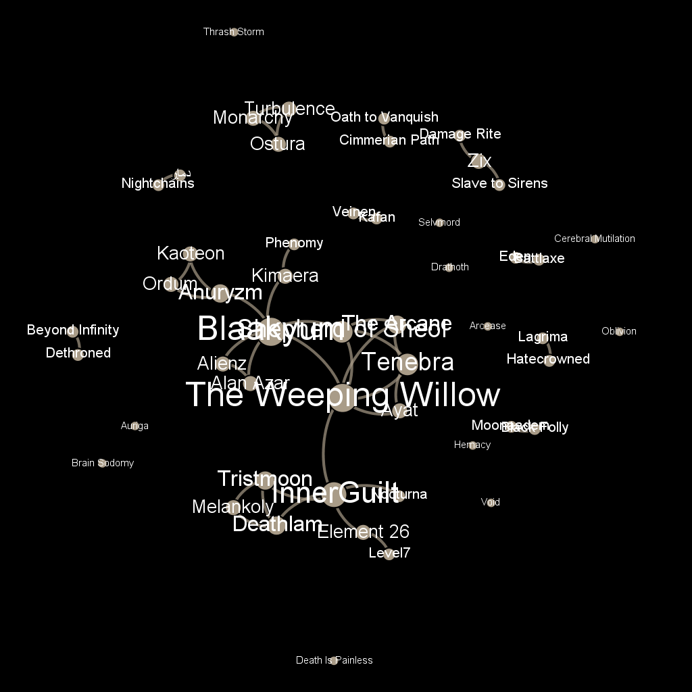

Go back to the _Overview_ and select _Expansion_ from the layouts and run it two or three times to expand the graph.

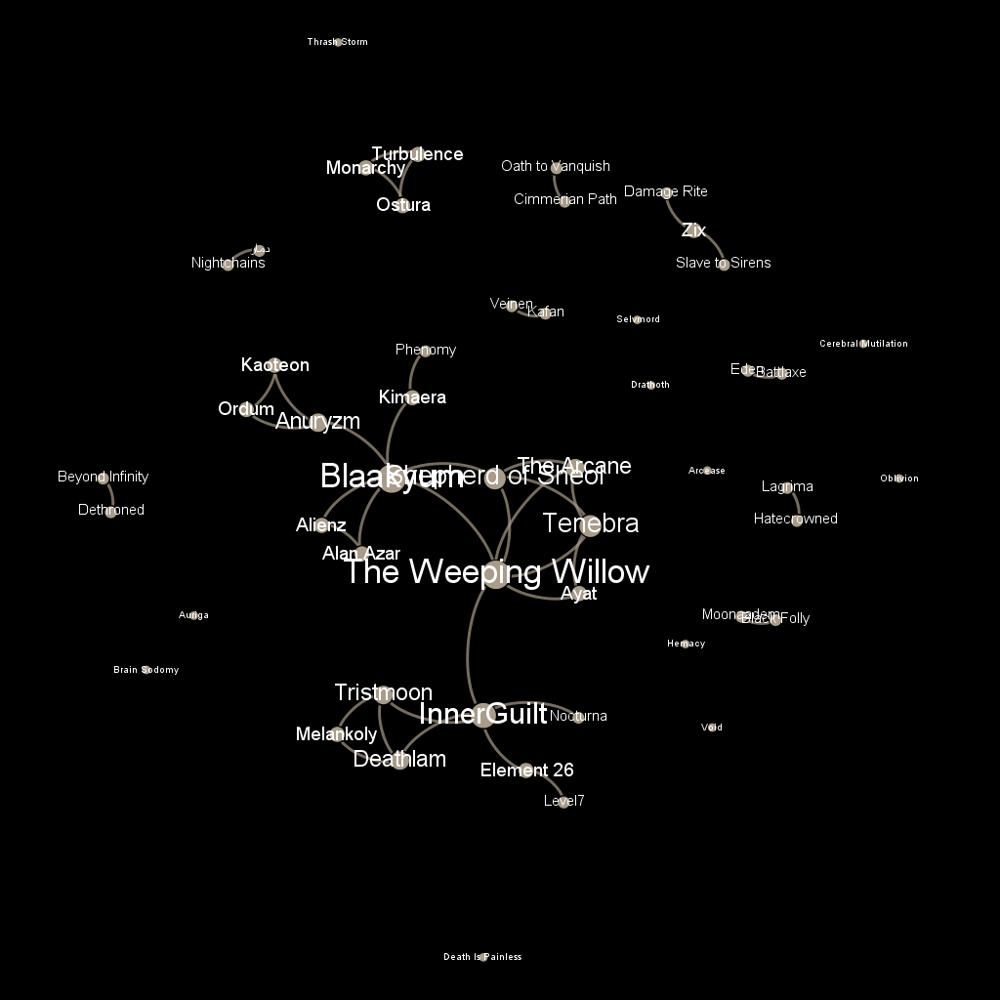

Afterwards I recommend to run _Noverlap_ (to prevent nodes to overlap) and _Label Adjust_ (to adjust labels so that they
don't overlap).

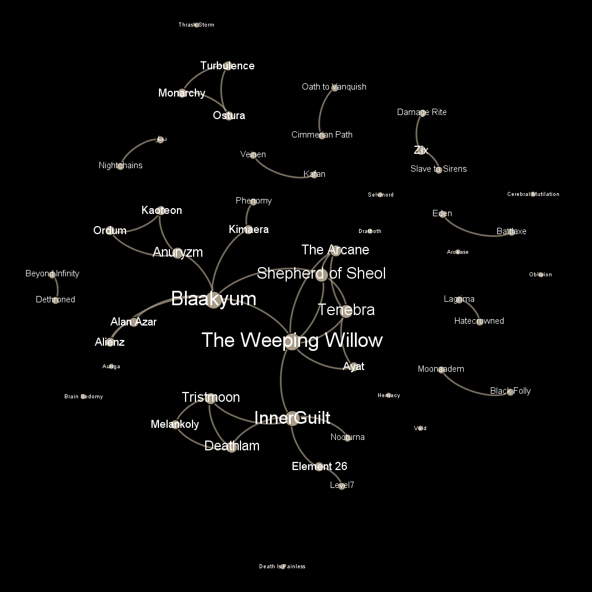

Go back to the preview, refresh to verify that the graph looks ok and then export a PDF and marvel at it in your 
favourite PDF viewer.

Extra fancy export into a HTML5 webpage: Install _SigmaExporter_ through _Tools_ → _Plugins_. Trigger the export with 
_File_ → _Export_ → _Sigma-js template_.

