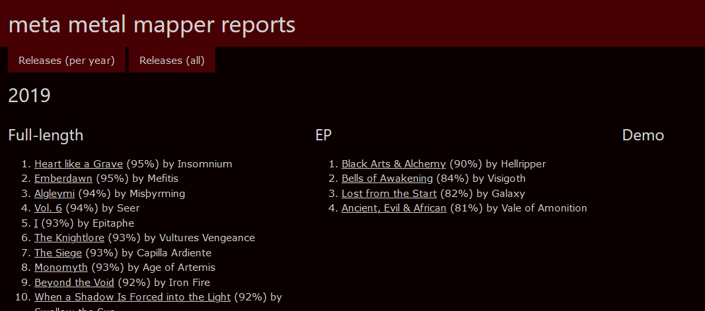

# How to use

`meta_metal_mapper.py`, when called on without switches, shows a list of program
switches and some hints how to use them. The program does not have an
interactive mode. Every function needs data from previous runs, except the
bootstrapping.

The typical workflow follows these steps:

1. Create a graph (aka database) in _Neo4j Desktop_.
2. Crawl either
    * a single band and connected bands **or**
    * a country or a region for band 
    links on M-A,
3. Crawl the bands from the countries or regions (not needed for a single band
    crawl),
4. Opening Neo4j Desktop and inspect the graph and
5. Print raw analysis in the terminal, export `.graphml` and statistics files.

The following sections will guide you through the usage of the program.

## Crawling

_Crawling_ is the process of either getting band links from country pages or
getting band data from their pages into the database. 

### Crawl a single band and all connected bands

The _single_ mode is the first choice to generate small networks of bands.
Call the program with the switch `-s` and a short link (e.g. `Emperor/30`) for
the band. The given band and all linked bands from the complete lineup are
crawled. The screenshot shows the bands Emperor's Samoth is and was involved
in:

There's no distinction between actual, past or a live bands. Live members can 
be filtered in `settings.py` with `IS_LIVE_MEMBER_IN_BAND`.

**Note**: This mode will not get you any useful information when country 
statistics are generated.

### Crawl a country or a region for band links

The initial requirement to use Meta Metal Mapper is having band links to crawl.
There are two ways of creating band lists:

* Start with the switch `-i N1 [N2] ...` to crawl all bands in all supplied
  countries **or**
* Call with `-r NNN` where NNN is the key of the region you want to crawl.

Crawling an entire region is recommended only for small regions with a low
amount of bands or to update with new bands.

Band list files are generated by country (from M-A's ["by country
page"](https://www.metal-archives.com/browse/country)) with at least one band
entry.  The names of the files follow this simple scheme: `NN.lnks` where NN is
the two letter short form.

The contents of an `.lnks` file looks like this (see `data/true_kings.lnks`):

    Emperor/30
    Ancient/772
    Dimmu_Borgir/69
    Immortal/75
    Arcturus/292

Together with `https://www.metal-archives.com/bands/` a fully fledged link to
every band can be generated whenever it is needed. You can easily build files
with the short links of your favorite bands.

You can define your own regions in `country_helper.py`. Just make sure that a
region code has three letters (or more) so that no country link files will be
overwritten in a crawl.

## Create a graph in Neo4j Desktop

Before bands can be crawled a database needs to be created.

1. Open Neo4j Desktop.
2. Click _Add Graph_ → _Create a Local Graph_. Anything from 3.5.x to 4.4.5
   should work fine.
3. Give it a name and a password.
4. Open `settings.py` and change `NEO4J_PASSWORD` to what you entered in the
   above step.
5. Start the database. Remember that you need to start the database every time
   you want to interact with the database.

## Crawl bands

Several options are available to crawl bands from the above generated link
files:

1. `-c <path/to/file>`: Crawls the bands in the given file.
2. `-c <country>`: Use this for the countries you crawled wit `-i`. Just pass
   the ISO short (e.g. NO for Norway). The program tries to find the correct
   link file in the `links` folder. 
3. `-c <region_id>`: Crawls bands from the region file found in
   `./links`.

Eight threads are used by default to crawl for bands (See the [performance
analysis](DESIGN_NOTES.md) for the amount of crawling threads).  Data is applied
immediately to the [graph database](DATABASES.md) and won't be overwritten.

### Error cases

A band might encounter unrecoverable errors while crawling. This might happen if
the band does not exist or the network connection breaks down. Unrecoverable
bands will be saved in a file in `./links` and a name like
`_bands_with_errors_{time_stamp}`. The resulting files contain short band links
(as the other `.lnks` files) and can be used for crawling. If you notice from
the log that a band was removed from M-A simply remove the line from the file.
In case of defects drop me a message or fix it yourself and issue a pull
request.

## Inspecting a graph

Open Neo4j Desktop and inspect the graph.

  1. Install Neo4j Browser with the "Add Application" button inside Neo4j
     Desktop.
  1. Start Neo4j Browser.
  3. Click on the database icon (top left).
  4. Enter `MATCH (n) RETURN n LIMIT 250` in the text box starting with the $
     symbol and press play.

You might want to use a higher number than 250 if you already have more than 250
entities in the database. Depending on how strong your machine is, ~1000 might
be the usable maximum. To change the maximum node number you need to open the
Neo4j Browser, click on the cog icon (lower left) anf change the value of
_Initial Node Display_.

See also [database entities](DATABASES.md) for in-depth details and the
[examples](EXAMPLES.md) section.

## Analysis

After e.g. crawling a region or a country, you can start analyzing the data.
Running the program with either of the available switches prints some
information on the command line. Far more interesting are the exported CSV and
GraphML files. They are named after their general category followed by a
timestamp and the file type (depicted by a * in the following sections).

* `-z`: Analyses and exports data of the whole database but does not generate
    any country specific statistics. This mode is useful for small networks
    and simply if not all bands of a country are available. 
* `-y ALL`: Considers the entire database and includes country specific 
    information.
* `-y <countries>`: In this case `<countries>` is a list of ISO
    shorts (`N1 N2 N3`).
* `-y <region_id>`: Passing a `<region_id>` analyses a list of ISO
    shorts (see `-l`).
Both latter options also check for:
* Missing bands; not found in database but in the country links file.
* Invalid bands; found in database but not in the country links file.

Files with the missing or invalid bands are saved in `links_missing` or 
`links_valid`. The naming pattern is `<IsoCountry>_YY-MM-DD_hhmmss.lnks`. 

### Countries

List countries and their properties like total number of bands, bands per 100k
people, a gender breakdown and the TOP genre.

The file pattern is `countries_*`.

| Country | Population | Bands | Bands per 100k | # Total | # Male | % Male | # Female | % Female | # Unknown | % Unknown | TOP genre |
| ------------- |---------------|------|------|------|------|------|------|------|------|------|------|
| Norway | 5.378.857 | 1702 | 31,64 | 5782 | 5523 | 95,52 | 240 | 4,15 | 19 | 0,33 | Black Metal |
| Denmark | 5.771.876 | 999 | 17,31 | 3623 | 3545 | 97,85 | 77 | 2,13 | 1 | 0,03 | Death Metal |

### All genres

List all known genres and the count for each one per country.

The file pattern is `genres_all_*`.

| Genre | Total | Norway | Denmark |
|---|---|---|---|
| Black | 1135 | 862 | 271 |
| Death | 732 | 381 | 351 |
| Thrash | 441 | 249 | 192 |
| Heavy | 316 | 147 | 169 |
| Doom/Stoner/Sludge | 298 | 178 | 120 |

### All core genres

_Core_ does not mean what you might think in this context. It's merely the most
[common genre names](https://www.metal-archives.com/browse/genre) as M-A defines them.

The CSV contains the core genres and the count for each one per country.

The file pattern is `genres_core_*`.

It looks similar to the _all genres_ table.

### Releases per year

This CSV groups releases on a per year basis. Most recent year at the top. The
releases per year are grouped descending on their rating. Release entries in the
database store the average rating of e.g. a full length album or demo. The other
metric is the number of reviews. I arbitrarily tried cut-off values to filter
releases:

* `RELEASE_REVIEW_COUNT_MIN`: The minimum amount of reviews a release needs to
  be considered for the export (default 3).
* `RELEASE_AVERAGE_MIN`: The minimum average score a release needs (default 80).
* `RELEASE_TYPES_REVIEW`: By default we consider Albums (F), EPs (E) and Demos
  (D). Other valid types can be found in `RELEASE_TYPES`(see `choices.py`).

If you don't like the standard settings from `settings.py`, try to change the
properties to something that works for you. The file pattern is
`releases_per_year_*`. Note that a JSON file of the release data is also
exported.

### Bands formed per year

Files named `bands_formed_*` give an overview of how many bands were formed over
the years. The time frame is decided by the oldest and newest bands. Years with
no bands within the time span will be added with zero as count. Columns are
sorted left to right by total amount of bands formed.

### HTML reports

An HTML file with all and per year releases is generated inside the reports
folder. The reports can be influences with `settings.py` as described above.

### Usage and output example

Two switches are available to analyze data, print to the command line, and
export `.graphml` networks:

* `-y ALL`: Analyze the entire database.
* `-y NN`: Analyze only the given country.
* `-y NN1,NN2,RR1`: Analyze all given countries and/or regions.

The country analysis for all Norwegian band might look similar to this:

    Norway
      Population: 5,378,857
      Bands: 1706
      Bands per 100k people: 31.72%
      Gender distribution (5779 artists from 45 countries)
        Male: 5520 (95.52%)
        Female: 240 (4.15%)
        Unknown/other: 19 (0.33%)
      TOP 5 Genres;
        Black: 865 (50.70%)
        Death: 381 (22.33%)
        Thrash: 249 (14.60%)
        Doom/Stoner/Sludge: 178 (10.43%)
        Progressive: 165 (9.67%)

By default all bands (including unconnected ones) are exported. Band members
which played only live are considered to be part of a band. These options are
available in `settings.py`:

* `IS_LIVE_MEMBER_IN_BAND`: Used to decide if a live band member is considered
  to make connections between bands or not.
* `FILTER_UNCONNECTED`: Any band which is not connected to any other bands will
  be filtered.

### Using exported `.graphml` files

The [Gephi intro page](GEPHI_HOWTO.md) explains how to use the generated
`.graphml` files.

